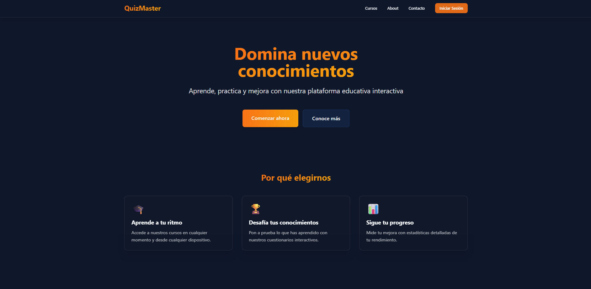

  <h1>Quiz Master Project</h1>
  
  

    <em>Plataforma de aprendizaje interactivo con cuestionarios y cursos para una experiencia educativa inmersiva.</em>
  

  
  
  
  
  
  

## Vista Previa del Proyecto

  
  
<em>Interfaz principal de Quiz Master mostrando el dashboard de aprendizaje</em>

## Características Principales

- **Sistema de Cuestionarios Interactivos**: Crea y responde cuestionarios sobre diversos temas.
- **Cursos Estructurados**: Accede a cursos organizados por categorías y niveles.
- **Seguimiento de Progreso**: Visualiza tu avance en los cursos y cuestionarios.
- **Diseño Responsivo**: Funciona perfectamente en dispositivos móviles y de escritorio.
- **Autenticación de Usuarios**: Sistema de registro e inicio de sesión para guardar tu progreso.

## Cómo Empezar

1. Clona el repositorio
2. Instala las dependencias: `pnpm install`
3. Inicia el servidor de desarrollo: `pnpm dev`
4. Abre [http://localhost:4321](http://localhost:4321) en tu navegador

## Contribución

Si deseas contribuir al proyecto, por favor, sigue estos pasos:

1. Fork el repositorio
2. Crea una rama para tu contribución
3. Realiza los cambios y crea una pull request

## Licencia

Este proyecto está licenciado bajo la Licencia MIT - ver el archivo [LICENSE](LICENSE) para más detalles.
